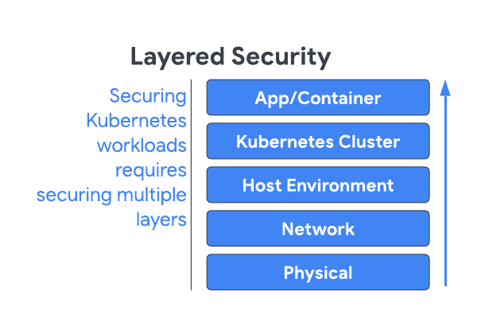
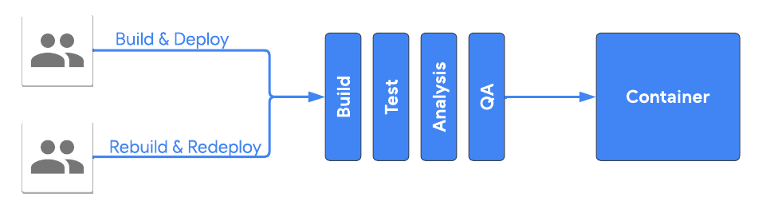
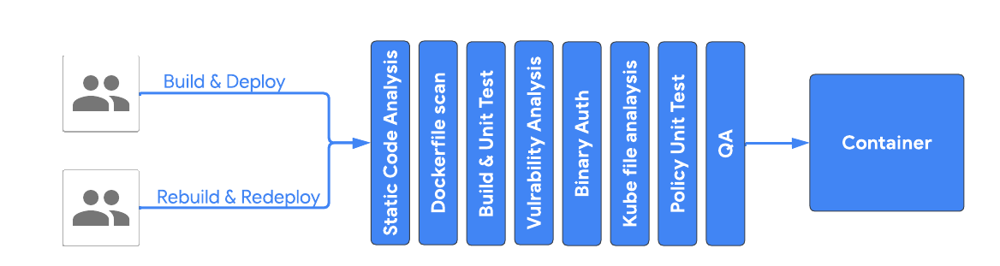
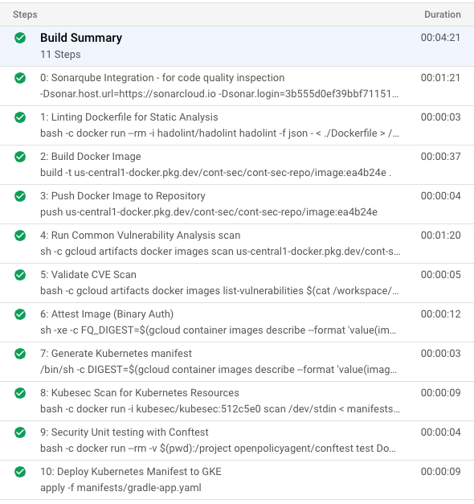
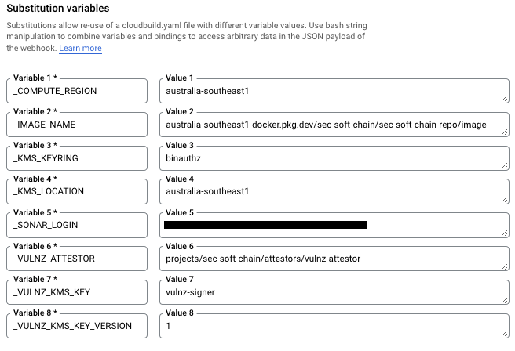
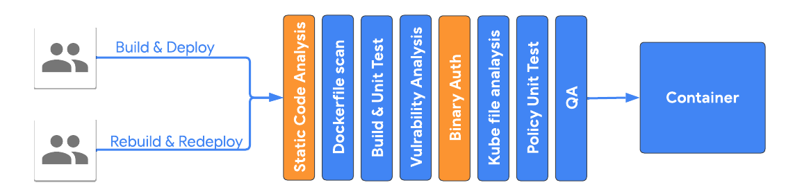
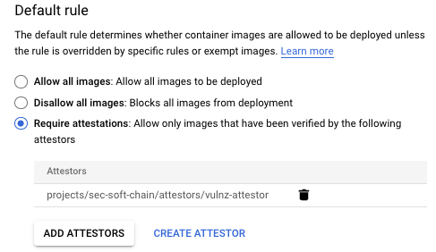

# Securing software supply chain

## Introduction

The purpose of this document is to provide a step by step guide and related artifacts to set up a secured CI/CD pipeline for a containerized workload. While the overall ecosystem security involves multiple layers, from securing underline physical infrastructure to actual code, this document focuses on the Application/Container security that can be automated in the CI/CD pipeline.



## System Overview

In this demo, we are using a simple java application (with Gradle build tool) that is containerized using Dockerfile and CI/CD pipeline is configured using cloudbuild.yaml. Other technologies/services used to implement this CI/CD pipelines are:

1. [Cloud Source Repository](https://cloud.google.com/container-registry/docs)
2. [Artifact Registry](https://cloud.google.com/artifact-registry/docs)
3. [CloudBuild](https://cloud.google.com/build/docs/concepts)
4. [Container Analysis](https://cloud.google.com/container-analysis/docs/container-analysis)
5. [Binary Authorization](https://cloud.google.com/binary-authorization/docs)
6. [Hadolint](https://github.com/hadolint/hadolint)
7. [Kubesec](https://kubesec.io/)
8. [Conftest](https://www.conftest.dev/)
9. [SonarQube](https://www.sonarqube.org/)


# Standard CI/CD Pipeline

A standard CI/CD pipeline generally consists of 4-5 stages. For example, Build, Test, Static code Analysis and QA stage. These stages are more developer focused and It only makes sure code builds successfully, it follows general coding guidelines and it fulfills functional requirements.


Artifacts used in these stages are the following:

* Application code
* Dockerfile
* Container Image
* Kubernetes Manifest files

All of these artifacts are vulnerable to security lapses. Following is the list of vulnerabilities they can introduce:

**Application Code**

* SQL Injection
* Cross site scripting
* Code Injection
* Sensitive Cookies without “HttpOnly” flag
* and many more

Scanning tool: [SonarQube](https://www.sonarqube.org/)

**Dockerfile**

* Unnecessary library and packages that increase attack surface
* Unofficial base image that can be vulnerable
* Image without tag make application inconsistent
* and many more

 Scanning tool: [Hadolint](https://github.com/hadolint/hadolint), [Confest](https://www.conftest.dev/)

**Container Image**

* Buffer Overflow that can lead to Denial of service
* Integer overflow that can impact confidentiality
* Command Injection
* and many more

 Scanning tool: [Container Analysis](https://cloud.google.com/container-analysis/docs/container-analysis)

**Kubermetes manifest file**

* Least privilege principle violation
* Mutable file system increase attack surface area
* No limit on CPU & memory can lead to DOS via resource exhaustion
* Unnecessary capability given to a container can lead to increase syscall attack surface

Scanning tool: [Kubesec](https://kubesec.io/), [Confest](https://www.conftest.dev/)

# Secured CI/CD Pipeline

With a little more effort, we can handle mitigate the vulnerabilities discussed in the previous section.




# Demo scope & output

CI/CD pipeline for this demo consists of 11 steps and out of them 7 steps are created to make this supply chain more secure.

Build steps can be broken down into categories like:

1. Static code analysis
2. Build+Push
3. Vulnerability Scanning
4. Attestation
5. Generate Kubernetes Manifest
6. Deploy





# Demo setup

## Prerequisites

1. A Google Cloud Project
2. A GKE cluster with --enable-binauthz,
3. An Artifact Repository
4. Set project variables, by replacing the example, below:

```

PROJECT\_ID=sec-soft-chain
REGION=australia-southeast1
ZONE=australia-southeast1-b

# Create a project and set as default
gcloud projects create $PROJECT\_ID –set-as-default 

# Enable the Required API’s
gcloud services enable container.googleapis.com
gcloud services enable artifactregistry.googleapis.com
gcloud services enable ondemandscanning.googleapis.com
gcloud services enable cloudkms.googleapis.com
gcloud services enable binaryauthorization.googleapis.com

# Create a cluster for this demo, not production ready settings being used here
gcloud beta container --project $PROJECT\_ID clusters create "software-secure-supply" --zone $ZONE --no-enable-basic-auth --cluster-version "1.22.8-gke.201" --release-channel "regular" --machine-type "e2-standard-4" --image-type "COS\_CONTAINERD" --disk-type "pd-standard" --disk-size "100" --metadata disable-legacy-endpoints=true --scopes "https://www.googleapis.com/auth/devstorage.read\_only","https://www.googleapis.com/auth/logging.write","https://www.googleapis.com/auth/monitoring","https://www.googleapis.com/auth/servicecontrol","https://www.googleapis.com/auth/service.management.readonly","https://www.googleapis.com/auth/trace.append" --max-pods-per-node "110" --num-nodes "2" --logging=SYSTEM,WORKLOAD --monitoring=SYSTEM --enable-ip-alias --network "projects/$PROJECT\_ID/global/networks/default" --subnetwork "projects/$PROJECT\_ID/regions/$REGION/subnetworks/default" --no-enable-intra-node-visibility --default-max-pods-per-node "110" --no-enable-master-authorized-networks --addons HorizontalPodAutoscaling,HttpLoadBalancing,GcePersistentDiskCsiDriver --enable-autoupgrade --enable-autorepair --max-surge-upgrade 1 --max-unavailable-upgrade 1 --enable-shielded-nodes --node-locations $ZONE --enable-binauthz

# Create an Artifact Repository
gcloud artifacts repositories create "${PROJECT\_ID}-repo" --location=$REGION  --repository-format=docker

# Allow the Cloud Build Service Account to run scans
gcloud projects add-iam-policy-binding $PROJECT\_ID  --member=serviceAccount:$(gcloud projects describe $PROJECT\_ID --format="value(projectNumber)")@cloudbuild.gserviceaccount.com --role=roles/ondemandscanning.admin 

# Allow the Cloud Build Service Account to deploy to GKE
gcloud projects add-iam-policy-binding $PROJECT\_ID  --member=serviceAccount:$(gcloud projects describe $PROJECT\_ID --format="value(projectNumber)")@cloudbuild.gserviceaccount.com --role=roles/container.developer

# Allow Cloud Build Service Account the permission to attest
gcloud projects add-iam-policy-binding $PROJECT\_ID  --member=serviceAccount:$(gcloud projects describe $PROJECT\_ID --format="value(projectNumber)")@cloudbuild.gserviceaccount.com --role=roles/containeranalysis.notes.attacher
```

## Setup Cloud Source Repository

1. Clone the following [repository](https://github.com/GoogleCloudPlatform/professional-services/tree/main/examples/secure-software-delivery) to your local machine 

```
git clone <https://github.com/GoogleCloudPlatform/professional-services/tree/main/examples/secure-software-delivery>
```
2. Push the cloned repo to your own [Cloud Source](https://source.cloud.google.com/repo/create) repository.
```
# Create a repo called sec-soft-chain
gcloud source repos create sec-soft-chain

# Configure credentials
gcloud init && git config --global credential.https://source.developers.google.com.helper gcloud.sh

# Add your new repo as a remote repo called google
git remote add google https://source.developers.google.com/p/$PROJECT_ID/r/sec-soft-chain

# Push code to the new repo called google
git push --all google
```

## Create the Cloud Build trigger

1. In the Cloud console, go to the Cloud Build Triggers page
2. Enable the API
3. [Go to Triggers](https://console.cloud.google.com/cloud-build/triggers)
4. Click Create Trigger.
5. In the Trigger Settings window, enter the following details:
    * In the Name field, enter build-vulnz-deploy.
    * For Event choose Push to a branch.
    * In the Repository field, choose your repo from the menu.
    * In the Branch field, enter main.
    * For Configuration, select Cloud Build configuration file (yaml or json).
    * In the Location, select Repository enter the default value /cloudbuild.yaml.
6. Add the following Substitution Variable pairs:
    * \_IMAGE\_NAME with the image from Cloud Artifact Registry this should be <REGION>-docker.pkg.dev/<PROJECT\_ID>/<PROJECT\_ID>-repo/image
    * e.g. australia-southeast1-docker.pkg.dev/sec-soft-chain/sec-soft-chain-repo/image \_COMPUTE\_REGION with the value: us-central1 (or the region you chose in the beginning)
    * \_KMS\_KEYRING with the value: binauthz
    * \_KMS\_LOCATION with the value: us-central1 (or the region you chose in the beginning)
    * \_VULNZ\_ATTESTOR with the value: vulnz-attesto
    * \_VULNZ\_KMS\_KEY with the value: vulnz-signer
    * \_VULNZ\_KMS\_KEY\_VERSION with the value: 1
    * \_SONAR\_LOGIN can be blank for now
    * \_SONAR\_PROJECT can be blank for now
    * \_SONAR\_ORG can be blank for now
7. Click Create



Congratulations!!!

you have successfully configured most of the stages (other than a couple, highlighted in yellow). You can very easily replicate this in your actual project by just copying a couple of files (with a little modification).

Please note that you will have to comment these two stages if you want to test till this point.




The remaining two stages will require some more configurations outside the code, let us see how can we set them up one by one:

## Modify cloudbuild.yaml

The Cloudbuild.yaml file in the repo needs a few changes these can be done manually by replacing each instance of the following variables:

* \<ZONE>
* \<REGION>
* \<REPO>
* \<IMAGE>
* \<PROJECT\_ID>

Or the below scripts should set these as per the variables configured previously:giot
```
sed -i "s/<ZONE>/$ZONE/g" cloudbuild.yaml
sed -i "s/<REGION>/$REGION/g" cloudbuild.yaml
sed -i "s/<PROJECT\_ID>/$PROJECT\_ID/g" cloudbuild.yaml
sed -i "s/<REPO>/$PROJECT\_ID-repo/g" cloudbuild.yaml
sed -i "s/<IMAGE>/image/g" cloudbuild.yaml
```

## Setup Sonarqube

<https://github.com/GoogleCloudPlatform/cloud-builders-community/tree/master/sonarqube>

1. Clone <https://github.com/GoogleCloudPlatform/cloud-builders-community> repository.
```
    git clone https://github.com/GoogleCloudPlatform/cloud-builders-community 
```
2. Create custom builder by running following commands:
```
    cd cloud-builders-community/sonarqube/
    gcloud builds submit .
```
3. Configure sonarqube (we will configure sonarqube online, but you can set up your own sonarqube server and configure that too).

 Login to <https://sonarcloud.io> with your github account

* Create a token by navigating to Account page then click on security tab
* Next we need to use the "Analyze New Project" option to set up the project in sonarcloud. Note: Use setup manually option
* Note down the token you created, project key and the organization name
* Update the Cloud Build Trigger Variables for:
  * _SONAR_ORG
  * _SONAR_PROJECT
  * _SONAR_LOGIN


## Binary Authorization

Note: Given below is the list of stripped down actions borrowed from following link:

<https://cloud.google.com/architecture/binary-auth-with-cloud-build-and-gke>

### Build and register the custom build step with Cloud Build

1. Clone the Google Cloud build community repo:
```
    git clone <https://github.com/GoogleCloudPlatform/gke-binary-auth-tools> ~/binauthz-tools
```
2. Configure the Binary Authorization signer for Cloud Build: \
Before use, the code for the custom build step must be built into a container and pushed to Cloud Build. To do this, run the following commands:
```
    gcloud builds submit --project $PROJECT\_ID --tag "gcr.io/$PROJECT\_ID/cloudbuild-attestor" ~/binauthz-tools
```
3. The custom build step was pushed to your current project's Google Container Registry and is now ready for use

### Create Cloud KMS [asymmetric key](https://cloud.google.com/kms/docs/create-validate-signatures) for signing attestations

1. In Cloud Shell, create a Cloud KMS key ring named binauthz:
```
    gcloud kms keyrings create "binauthz" \
    --project "${PROJECT\_ID}" \
    --location "${REGION}"
```
2. Create an asymmetric Cloud KMS key named vulnz-signer which will be used to sign and verify vulnerability scan attestations:
```
    gcloud kms keys create "vulnz-signer" \
    --project "${PROJECT_ID}" \
     --location "${REGION}" \
     --keyring "binauthz" \
     --purpose "asymmetric-signing" \
     --default-algorithm "rsa-sign-pkcs1-4096-sha512"
```

### Create a Container Analysis note named vulnz-note
```
    curl "https://containeranalysis.googleapis.com/v1/projects/${PROJECT_ID}/notes/?noteId=vulnz-note" \
    --request "POST" \
    --header "Content-Type: application/json" \
    --header "Authorization: Bearer $(gcloud auth print-access-token)" \
    --header "X-Goog-User-Project: ${PROJECT_ID}" \
    --data-binary @- <<EOF
        {
        "name": "projects/${PROJECT_ID}/notes/vulnz-note",
        "attestation": {
            "hint": {
            "human_readable_name": "Vulnerability scan note"
            }
        }
        }
    EOF
```

### Give CloudBuild Service account name permission on note
```
    export CLOUD_BUILD_SA_EMAIL=$(gcloud projects describe $PROJECT_ID --format="value(projectNumber)")@cloudbuild.gserviceaccount.com

    ​​curl "https://containeranalysis.googleapis.com/v1/projects/${PROJECT_ID}/notes/vulnz-note:setIamPolicy" \
    --request POST \
    --header "Content-Type: application/json" \
    --header "Authorization: Bearer $(gcloud auth print-access-token)" \
    --header "X-Goog-User-Project: ${PROJECT_ID}" \
    --data-binary @- <<EOF
        {
        "resource": "projects/${PROJECT_ID}/notes/vulnz-note",
        "policy": {
            "bindings": [
            {
                "role": "roles/containeranalysis.notes.occurrences.viewer",
                "members": [
                "serviceAccount:${CLOUD_BUILD_SA_EMAIL}"
                ]
            },
            {
                "role": "roles/containeranalysis.notes.attacher",
                "members": [
                "serviceAccount:${CLOUD_BUILD_SA_EMAIL}"
                ]
            }
            ]
        }
        }
    EOF
```

### Create the vulnerability scan attestor
```
    gcloud container binauthz attestors create "vulnz-attestor" \_
        --project "${PROJECT\_ID}" \
        --attestation-authority-note-project "${PROJECT\_ID}" \
        --attestation-authority-note "vulnz-note" \
        --description "Vulnerability scan attestor"
```
### Add the public key for the attestor's signing key
```
    gcloud beta container binauthz attestors public-keys add \
    --project "${PROJECT\_ID}" \
    --attestor "vulnz-attestor" \ 
    --keyversion "1" \ 
    --keyversion-key "vulnz-signer" \ 
    --keyversion-keyring "binauthz" \ 
    --keyversion-location "${REGION}" \ 
    --keyversion-project "${PROJECT\_ID}"
```
### Grant the Cloud Build service account permission to verify attestations made by vulnz-attestor
```
      gcloud container binauthz attestors add-iam-policy-binding "vulnz-attestor" \
      --project "${PROJECT\_ID}" \
      --member=serviceAccount:$(gcloud projects describe $PROJECT\_ID --format="value(projectNumber)")@cloudbuild.gserviceaccount.com \
      --role "roles/binaryauthorization.attestorsViewer"
```
### Grant the Cloud Build service account permission to sign objects using the vulnz-signer key
```
    gcloud kms keys add-iam-policy-binding "vulnz-signer" \
    --project "${PROJECT\_ID}" \
    --location "${REGION}" \ 
    --keyring "binauthz" \ 
    --member serviceAccount:$(gcloud projects describe $PROJECT\_ID --format="value(projectNumber)")@cloudbuild.gserviceaccount.com \
    --role 'roles/cloudkms.signerVerifier'
```
### Configure Binary Authorization default policy like below




From [Binary Authorization Policy](https://console.cloud.google.com/security/binary-authorization/policy) page you can add the project and Attestor name as shown:


## Further considerations

1. Purpose built OS images
2. Reducing Attack surface (limiting/disabling Port/user/services/packages)
3. Kernel Hardening with AppArmor & Seccomp
4. Behavioural Analytics/Falco
5. Managing Secrets
6. Regular Upgrade
7. Restrict API Server Access
8. Least privilege access using RBAC
9. Exercise caution with Service accounts
10. CIS Benchmarking
11. Secure Dashboard
12. Secure Ingress to Cluster
13. Network Policies
14. Auditing